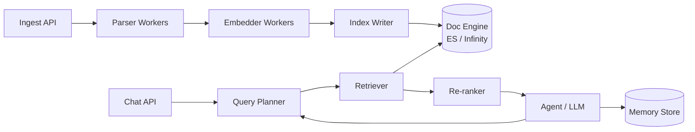

# Architectural Analysis of RAGFlow

**Author:** Prashanth Sreenivasan
**Course:** AI (Spring 2026) — Assignment 4

---

## 1. Deep document understanding vs naive chunking

Fixed-size chunking splits text every N tokens. It doesn't know what a table/heading is, so it might cut a table in half or separate a caption from the figure. DeepDoc reads the layout and maintains these parts together. 

This is important for retrieval because each chunk is one idea, so the embedding is more useful. It also gives the metadata (page number, section) which allows filtering out results before searching. 

The cost is that DeepDoc is slow. But ingestion happens once and better querying for a large number of queries outweighs the cost. For things like chat logs that change constantly, cheap chunking makes more sense. That's why RAGFlow has the option. 
---

## 2. Chunking strategy: template vs semantic

Template chunking uses rules you write ahead of time, like "split on every numbered clause in a contract." Semantic chunking uses embeddings to find topic boundaries automatically.

For structured documents templates work better. Every clause sounds similar, the structure is already there, so using a template is the better option here. 

For chat logs and forums there's no template to use. Semantic splitting wins because topic changes are the signal can use and semantic chunking picks these well. 

---

## 3. Hybrid retrieval architecture

BM25 relies on matching exact words, while vector search finds semantic matches. Since the methods fail in different ways, hybrid retrieval will yield better relevancy ranking compared to using only one approach. Finally, re-ranking will further increase the relevancy score and move highly relevant documents to the top of the list.

Failure scenarios:

- **Only lexical:** "How did liquidity change?" fails to return the document that says "the cash and equivalents declined."
- **Only vector:** If one searches for error ID E-4471, dense models will return a lot of similar error codes without finding the actual document.
- **Hybrid:** "Apple income" on the corpus that has data related to fruit production and technology sector. Both methods will rank both topics as relevant, and it is impossible for the re-ranker to identify the desired topic.

---

## 4. Retrieval pipeline with multiple stages

One-shot ANN query needs to solve two problems simultaneously, finding all relevant documents and ranking them accurately. These two problems have opposing requirements for cost and coverage. Searching requires low costs and high recall. Ranking requires high precision, but this comes at a cost of higher latency. This makes it impossible to solve both problems effectively in one pass.

Dividing the process into stages allows you to run an inexpensive ANN search over the whole corpus, followed by a costly cross-encoder over the top 100-200 documents. The latency remains low because the costly step only deals with a shortlist.

This introduces a problem of error propagation. Documents missed during stage 1 will not make it to stage 2. Thus, you have to fetch more documents at stage 1 (top 200 instead of top 20), combine retrieval methods to ensure diversity of the shortlist, and give the agent a chance to requery.

---

## 5. Indexing strategy and storage backends

| Backend           | Strengths                          | Weaknesses             | Use case                   |
|-------------------|-----------------------------------|------------------------|----------------------------|
| Elasticsearch-like | BM25, filters, robust ops         | Vector search is afterthought | Enterprise search w/ heavy metadata filters |
| Vector native (Infinity, Milvus) | Fast vector search, quantization, high throughput  | Poor lexical search     | Semantic search at volume, multimodal       |
| Graph-augmented  | Explainability, multi-hop queries  | Slow writes, difficult scaling | Complex queries, regulatory auditing  |

Decision criteria: Look at your read-to-write ratio (graphs don’t like writes), your query characteristics (filters -> ES, similarity -> vector, multi-hop -> graphs), and size. Savings from Infinity’s RAM efficiency become significant only beyond a billion vectors.

---

## 6. Query understanding and reformulation

The question asked by users cannot be phrased like documents are phrased. This is the so-called semantic gap. Passing the raw input to retrieval assumes that the embedding layer can bridge the semantic gap on its own.

Query rewriting can help in a number of ways. Query expansion (HyDE algorithm) creates a synthetic answer to do a search with, increasing recall. Decomposition splits "compare X and Y" type questions into two different questions. Rewriting handles the use of pronouns in multi-turn conversations; if done incorrectly, "and the second one?" returns no results.

Static rewriting involves a single call to an LLM, making the approach predictable. Iterative (agent-based) rewriting involves looking at the output returned and deciding to make additional calls if necessary. The process takes longer and the tail latency is terrible, but this is the only method available when handling questions for which we cannot tell what needs to be searched for until some evidence is returned.

---

## 7. Knowledge representation layer

**Dense vectors** work well for fuzzy search, but fail compositional queries such as "patents filed by subsidiaries of X after 2020". It's not possible to formulate such question using cosine similarity. And there is no explanation why a particular answer was chosen over others.

On the other hand, **relational schemas** are ideal for aggregations and join operations, highly explainable because the query itself is the proof. However, they require extraction of the schema which, obviously, is hard.

**Knowledge graphs**, again, are in between. Multi-hop retrieval is trivial; and explaining a particular result is easy – just show the path. The downside is that building a graph is expensive, and a missed edge leads to silent failure.

Thus, in real life we stack them, using dense vectors for recall, knowledge graphs for multi-hop queries and relational schema for aggregation. GraphRAG is not going to replace dense vector search, but augment it.

---

## 8. Data ingestion pipeline architecture

The ingestion pipeline comprises four stages: connect, normalize, enrich, index.

**Schema normalization:** any input (PDF, HTML, Slack, Confluence) should be normalized into a consistent schema such as `{doc_id, source, blocks[], metadata}` where `blocks` have types. The normalized schema is consumed downstream, and thus parsers are the only source-specific component.

**Incremental indexing:** re-indexing all data is inefficient. You need hash functions to ignore unchanged files, versioning for incremental updates, tombstones for deletions, and compaction to free disk space. Use change data capture (CDC) or periodic polling to pull deltas.

**Latency vs throughput tradeoff:** when every update needs to be immediately visible, throughput cannot exceed the indexing speed. With batching, throughput is increased but latency is introduced for reads. The classic solution is tiering with two paths: fast indexing for incremental updates and slow indexing for large batches of data. This aligns perfectly with RAGFlow's vision of "pipelines as LEGO."
---

## 9. Memory design in RAG systems

**Vector memory:** store every turn and retrieve via similarity. Economical and scalable but only finds similar things semantically. It cannot answer questions such as "what did we decide yesterday" since the term "yesterday" does not have any semantics.

**Structured memory:** extract facts to a schema format ("user prefers Python", "deadline: April 20"). More precise, queryable, and explainable. However, the extraction step is an LLM call each turn, and schemas tend to drift.

**Episodic logs:** append-only storage for the complete conversation history. Economical writes, useful for auditing and replay, but requires indexing for searching.

These are not mutually exclusive strategies; rather, they work together in a hierarchy, somewhat akin to cache levels. The episodic is the source of truth, the structured is the working set of facts, and the vector is the associative retrieval layer. An effective agent must utilize all three. The introduction of memory in RAGFlow version 0.23 and then governance in version 0.24 illustrates this progression.

---

## 10. End-to-end system decomposition

**Stateless Services:** Ingest API, parsers, embedders, retriever, re-ranker, query planner, chat API. Scale horizontally with queues in front — add pods until all queues drain. No sticky sessions required.

**Stateful Services:** Doc engine, memory store, and raw documents. Shard by doc_id, replicate for high availability. Write throughput is the limiting factor.

**Scaling Individual Components:** Parsers and embedders are GPU-bound, autoscale based on queue depth. Retriever is I/O-bound, scale on p99 latency. Re-ranker is GPU-bound and latency-sensitive, overprovision and batch. Use a semantic cache to handle duplicate queries for the LLM.

**Fault Isolation:** The key principle is that ingestion failures must not cause chat failures. Split queues, split write replicas, circuit breaker between agent and retriever. When the memory store is unavailable, the agent continues to run statelessly. When the re-ranker fails, revert to stage-1 scores with quality warnings.

---

